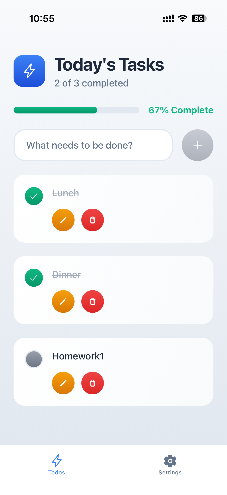
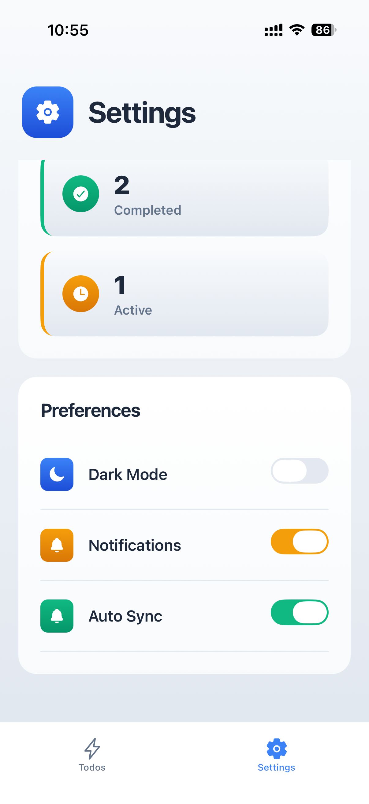

# To-Do App (React Native + Expo)

A simple learning project to practice full-stack mobile development with React Native.

This app lets you create and manage daily tasks with a clean UI, dark mode support, and a Convex backend.

## Tech Stack

- React Native (Expo SDK 54)
- Expo Router (file-based navigation)
- TypeScript
- Convex (real-time backend + database)
- AsyncStorage (persisting local theme preference)
- Expo Linear Gradient + Vector Icons (UI styling)

## Features

- Add new todos
- Edit existing todos
- Mark todos as completed/incomplete
- Delete a single todo
- Clear all todos (Danger Zone)
- Real-time todo data from Convex
- Dark mode toggle with persisted preference
- Progress stats and settings screen

## App Preview

<p align="center">
  
  
</p>

## Project Goal

This is a personal learning app focused on:

- Building a complete CRUD flow in React Native
- Integrating a hosted backend (Convex)
- Structuring a medium-size Expo Router project
- Practicing reusable components and theme systems

## Getting Started

### 1. Install dependencies

```bash
npm install
```

### 2. Configure environment variables

Create a `.env.local` file in the project root:

```env
CONVEX_DEPLOYMENT=your-convex-deployment
EXPO_PUBLIC_CONVEX_URL=https://your-project.convex.cloud
EXPO_PUBLIC_CONVEX_SITE_URL=https://your-project.convex.site
```

### 3. Run Convex dev server

```bash
npx convex dev
```

Keep this running in a separate terminal.

### 4. Start Expo app

```bash
npx expo start
```

Then open on:

- iOS Simulator
- Android Emulator
- Expo Go
- Web

## Available Scripts

- `npm run start` - Start Expo
- `npm run ios` - Open iOS simulator
- `npm run android` - Open Android emulator
- `npm run web` - Start web build
- `npm run lint` - Run lint checks

## Folder Structure

```text
to-do-app/
  app/                # Expo Router screens and hooks
  components/         # Reusable UI components
  assets/styles/      # Screen-level style creators
  convex/             # Backend functions + schema
```

## Notes

- Theme preference is stored locally using AsyncStorage.
- Todo data is stored in Convex and synced in real time.
- `app-example/` contains starter/template reference code from initial setup.

## Future Improvements

- Input validation and better error states
- Filter todos (All / Active / Completed)
- Due dates and reminders
- Authentication and user-specific todo lists
- Unit and integration tests

## Learning Credits

Built as a hands-on learning project using Expo and Convex.
